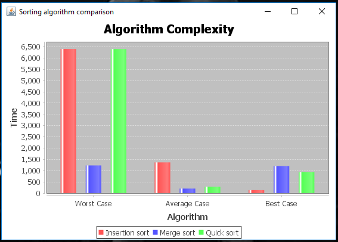

Sorting algorithm complexity comparison

Evaluated Worst case, average case and best case complexity of sorting algorithm.

From the graph, we can see that-

1. In worst case, Quick sort and Insertion sort performs in O(n2) and Merge sort performs in O(nlogn)

2. In average case, Quick sort and merge sort performs in O(nlogn) and insertion sort runs in O(n2)

3. In base case, Insertion sort performs well with complexity of O(n) and Quick sort and merge sort has complexity of O(nlogn)

 
The timing evaluated here is in Micro seconds
